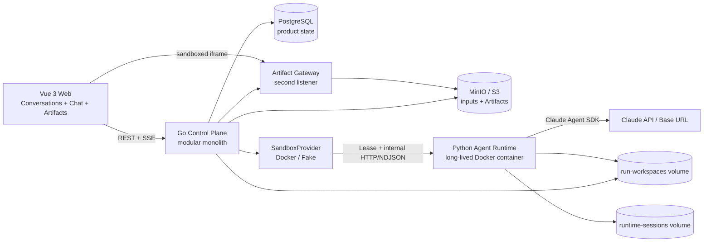

# Harness Forge V0 Design

- **Status:** Approved design
- **Date:** 2026-07-19
**Target:** A 2–4 week personal-project prototype

## 1. Summary

Harness Forge is a local-first harness for turning conversations and user-provided data into immutable, viewable artifacts. Its first Profile is **Geo Analyst**: the user uploads a CSV containing coordinates and numeric fields, asks Claude to analyze it, and receives an HTML report containing narrative findings, statistical charts, and an interactive geographic visualization.

The V0 is deliberately a vertical slice. It validates the complete path from conversation to sandboxed Agent execution to artifact publication. It does not attempt to build a general plugin platform first.

The repository is named **`harness-forge`**.

## 2. Product Goal and Acceptance Scenario

The V0 succeeds when a user can:

1. Start the whole system locally with Docker and one documented command.
2. Create a Project using the `geo-analysis` Profile.
3. Upload a CSV containing longitude, latitude, and numeric fields.
4. Create a Conversation and ask for a geographic analysis.
5. Watch the Agent response, tool activity, and Run progress stream into the UI.
6. View an HTML report with narrative findings, statistical charts, and an interactive map.
7. Continue the same Conversation and ask Claude to revise the analysis.
8. View the revision as a new immutable Artifact version without losing the old one.
9. Create a second Conversation in the same Project that shares the uploaded files but has independent Claude context.
10. Refresh the browser or reconnect SSE without losing durable product state.

## 3. Scope

### 3.1 V0 capabilities

- Local, single-user deployment.
- Vue 3 web interface with Conversation management, chat, Run progress, and Artifact preview.
- Go modular monolith as the control plane.
- Long-lived Python Agent Runtime container using the Claude Agent SDK.
- Anthropic API authentication plus configurable `ANTHROPIC_BASE_URL`.
- PostgreSQL for product metadata and durable queue state.
- MinIO through the S3 interface for uploaded inputs and immutable Artifacts.
- A persistent Runtime volume for Claude SDK sessions.
- A shared Run workspace volume for file exchange between Go and Python.
- Global concurrency of one Agent Run, backed by a FIFO queue.
- Profile configuration, with only `geo-analysis` implemented.
- User-uploaded CSV and GeoJSON inputs; the acceptance scenario uses CSV.
- Free-form Python coding by Claude using a fixed, version-locked Runtime image.
- HTML, Markdown, image, and data Artifacts; HTML/ECharts is the V0 primary output.
- Fake Runtime end-to-end tests and opt-in real-Claude smoke tests.

### 3.2 Explicit non-goals

- Authentication, authorization, multi-tenancy, or public hosting.
- Multi-provider Agent abstraction.
- WebSocket communication or human approval during an active Run.
- More than one concurrent Agent Run.
- Separate Go workers, an external message broker, or distributed scheduling.
- A fresh container or MicroVM per Run.
- Enforced network isolation. The V0 assumes a trusted local developer and allows unrestricted Runtime egress.
- A plugin marketplace, installable plugin lifecycle, or dynamic Runtime image matrix.
- Automatic retries.
- Background workspace retention, garbage collection, or a full observability stack.
- Code editor, terminal, file explorer, map editor, or Artifact authoring UI.
- A backend API callable by generated Artifacts.

## 4. Domain Language

Use the following terms consistently in code, contracts, database names, and documentation.

**Profile**:
A versioned definition of one Harness application behavior, including its prompt, tool policy, and Artifact rules. Avoid `Plugin` in V0.

**Project**:
A durable container for one Profile, uploaded Input Files, and Conversations. A Project is not a filesystem workspace.

**Input File**:
An immutable user-uploaded object owned by a Project.

**Conversation**:
A product-level chat inside one Project, with ordered Messages and a pointer to its active SDK Session. The UI labels it “会话”. Avoid the unqualified term `Session`.

**Message**:
A user or Agent message visible in a Conversation.

**Run**:
One execution attempt triggered by a user Message. A Message may have more than one Run after a manual rerun. Avoid the vague names `Task` and `Job`.

**SDK Session**:
Claude Agent SDK’s internal conversation context. It is Runtime implementation state, not the source of product chat history.

**Run Event**:
An append-only progress, text, tool, phase, or diagnostic event emitted while a Run executes.

**Artifact**:
An immutable, independently viewable output published by a successful Run. A Run may publish multiple Artifacts and at most one is primary.

**Workspace**:
An ephemeral filesystem directory materialized for a single Run. Avoid `Project Workspace`.

**Sandbox**:
The execution environment that hosts the Python Agent Runtime and a Run Workspace. The real V0 Sandbox is the long-lived Runtime container in Docker Compose; the Fake Sandbox exists only for deterministic tests.

**Sandbox Lease**:
A Run-scoped execution-environment handle acquired by the Control Plane. It exposes the Runtime protocol client, Sandbox-local paths, output synchronization, and idempotent release without exposing Docker or future E2B SDK details to the Run Coordinator.

## 5. System Architecture



### 5.1 Vue Web

The Web module owns only presentation and browser interaction:

- Project and Conversation selection.
- Input upload.
- Message submission.
- SSE subscription and reconnection.
- User-facing Run progress and errors.
- Artifact selection, history, and iframe preview.

It does not receive or interpret raw Claude Agent SDK messages.

### 5.2 Go Control Plane

The Go module is the sole authority for product state. It owns:

- Projects, Input Files, Conversations, Messages, Runs, Run Events, and Artifact metadata.
- PostgreSQL transactions and queue claiming.
- Global concurrency of one.
- Materializing Input Files into Run workspaces.
- Resolving a Profile file into an immutable configuration snapshot and digest for each Run.
- Acquiring, recovering, and releasing Run-scoped Leases through `SandboxProvider`.
- Calling, cancelling, and finalizing Agent Runtime executions through a Lease, and synchronizing remote outputs before publication.
- Mapping Runtime events to durable Run Events and browser SSE.
- Publishing validated Artifact files to MinIO.
- Serving Artifact files through a separate HTTP listener.

The Go process remains one deployable modular monolith. Internal packages create code locality, not independently deployed services.

### 5.3 Python Agent Runtime

The Runtime is a narrow adapter around the Claude Agent SDK. It owns:

- SDK configuration and process lifecycle.
- SDK Session creation, fork, resume, promotion candidate, and deletion.
- Applying the selected Profile prompt and tool policy.
- Starting a distinct Python Agent process and using a distinct Workspace per Run.
- Normalizing SDK messages into versioned Harness Runtime Events.
- Validating `artifact-manifest.json` and output paths.
- Terminating an active Agent process when cancellation is requested.

It does not connect to PostgreSQL or MinIO and is not the authority for product history.

The container has one long-lived HTTP server process. For every accepted Run, that server launches one Python worker subprocess, and the worker invokes the Claude Agent SDK. The server relays the worker's NDJSON events, owns its process group, and records an atomically written execution record below `runtime-sessions`. The Runtime rejects a second execution while one is active. Profile files are resolved by Go; Python receives and applies the resolved snapshot rather than reading repository Profile files itself.

### 5.4 PostgreSQL

PostgreSQL stores product metadata and the durable FIFO queue. The minimum logical schema is:

| Record | Important information |
|---|---|
| `projects` | ID, name, Profile ID/version, timestamps, logical deletion time |
| `input_files` | Project ID, display name, media type, size, digest, object key |
| `conversations` | Project ID, title, active SDK Session ID, timestamps, logical deletion time |
| `messages` | Conversation ID, role, content, timestamp |
| `runs` | Conversation ID, trigger Message ID, status, phase, SDK Session IDs, `sandbox_provider`, `sandbox_ref`, error, `finalized_at`, timestamps |
| `run_events` | Run ID, monotonic sequence, event type, payload, timestamp |
| `artifacts` | Run ID, title, type, entry path, object prefix, primary flag, manifest version |

Product history never has to be reconstructed from SDK transcript files.

Sandbox columns have these exact states:

| `sandbox_provider` | `sandbox_ref` | Run state | Meaning |
|---|---|---|---|
| null | null | any | Sandbox acquisition has not started |
| non-null | null | running/unfinalized terminal | Acquire is pending or its outcome is uncertain |
| non-null | null | finalized terminal | Acquire definitively created no Lease |
| non-null | non-null | unfinalized | Lease exists and still requires disposition and/or release |
| non-null | non-null | finalized | Lease was released; values remain as audit/recovery metadata |
| null | non-null | any | Invalid database state |

### 5.5 MinIO/S3

Object storage contains two durable classes of content:

```text
projects/{project_id}/inputs/{input_file_id}/{filename}
projects/{project_id}/artifacts/{artifact_id}/{relative_path}
```

Artifact objects are immutable once published.

Go allocates each Artifact ID before uploading and writes directly to its final immutable object prefix. MinIO is private, and the Artifact Gateway serves an object only when a matching committed PostgreSQL Artifact record exists. Therefore pre-commit objects are unreachable even though they already use final keys. A failed metadata commit leaves an invisible orphan prefix that the explicit cleanup command can remove; publication never requires an S3 rename or copy.

### 5.6 Volumes

- `run-workspaces`: mounted by Go and the Runtime. Go materializes inputs and publishes outputs; the Runtime executes against them.
- `runtime-sessions`: mounted only by the Runtime. It persists SDK transcript/session files across container restarts.

Only Go receives PostgreSQL and MinIO credentials. Claude credentials are injected only into the Runtime through local secret configuration.

## 6. Repository Layout

```text
harness-forge/
├── apps/
│   └── web/
│       ├── src/
│       │   ├── app/
│       │   ├── features/
│       │   │   ├── projects/
│       │   │   ├── conversations/
│       │   │   ├── chat/
│       │   │   ├── runs/
│       │   │   └── artifacts/
│       │   ├── lib/
│       │   │   ├── api/
│       │   │   └── artifact-viewer/
│       │   └── main.ts
│       ├── tests/
│       ├── package.json
│       └── vite.config.ts
│
├── services/
│   ├── control-plane/
│   │   ├── cmd/
│   │   │   └── harness-forge/
│   │   │       └── main.go
│   │   ├── internal/
│   │   │   ├── projects/
│   │   │   ├── conversations/
│   │   │   ├── runs/
│   │   │   ├── artifacts/
│   │   │   ├── profiles/
│   │   │   ├── agentexec/
│   │   │   ├── sandbox/
│   │   │   ├── httpapi/
│   │   │   ├── artifacthttp/
│   │   │   ├── postgres/
│   │   │   └── objectstore/
│   │   ├── migrations/
│   │   ├── tests/
│   │   └── go.mod
│   │
│   └── agent-runtime/
│       ├── src/
│       │   └── harness_forge_runtime/
│       │       ├── api.py
│       │       ├── runner.py
│       │       ├── claude.py
│       │       ├── sessions.py
│       │       ├── workspaces.py
│       │       ├── artifacts.py
│       │       ├── permissions.py
│       │       └── events.py
│       ├── tests/
│       ├── Dockerfile
│       ├── pyproject.toml
│       └── lockfile
│
├── profiles/
│   └── geo-analysis/
│       ├── profile.yaml
│       ├── system-prompt.md
│       └── workspace-template/
│           └── assets/
│               └── echarts.min.js
│
├── contracts/
│   ├── control-plane.openapi.yaml
│   ├── runtime/
│   │   └── v1/
│   │       ├── run-request.schema.json
│   │       └── runtime-event.schema.json
│   └── artifacts/
│       └── v1/
│           └── artifact-manifest.schema.json
│
├── tests/
│   └── e2e/
│       ├── scenarios/
│       │   └── geo-csv-report/
│       └── fixtures/
│
├── infra/
│   ├── minio/
│   └── postgres/
├── docs/
│   ├── architecture/
│   ├── decisions/
│   └── development/
├── docker-compose.yaml
├── Makefile
├── .env.example
├── .gitignore
└── README.md
```

The layout intentionally excludes `plugins/`, a cross-language `shared/` directory, a generic Go `pkg/`, multiple Go processes, and speculative repository interfaces. `agentexec` only encapsulates the stable Runtime HTTP/NDJSON protocol. `sandbox` is the outer execution-environment seam and has Docker and Fake providers in V0. An E2B adapter, E2B SDK dependency, remote persistent volumes, pooling, and per-Project/Profile/Run provider selection are explicitly outside V0.

## 7. Interfaces

### 7.1 Browser-facing control-plane interface

The exact resource shapes belong in `control-plane.openapi.yaml`. The V0 requires these capabilities:

- List, create, read, rename, and logically delete Projects.
- Upload and list Project Input Files.
- List, create, rename, and logically delete Conversations.
- List Conversation Messages.
- Submit a user Message and create a queued Run atomically.
- Read Run status and Run Events.
- Subscribe to Run Events with SSE and resume from a sequence number.
- Cancel a queued or active Run.
- List Run Artifacts and identify the primary Artifact.

Project and Conversation deletion are logical in V0: the record receives `deleted_at` and disappears from default queries. A delete request is rejected with `409 Conflict` while the target Project or Conversation has a `queued`, `running`, or not-yet-finalized Run; the user must cancel it or wait for finalization first. A logically deleted Project or Conversation cannot accept new Messages, Runs, or late Session promotion.

No object, Workspace, or SDK Session is physically removed during the delete request. An explicit, idempotent `make purge-deleted` maintenance command performs physical cleanup in this order: delete owned MinIO prefixes; use the Run's recorded Provider/ref when Runtime cleanup is still required; delete owned SDK Sessions; remove retained Run Workspaces; delete terminal Runtime execution tombstones; idempotently release the Lease; then hard-delete PostgreSQL records last. Missing Sandboxes, objects, Sessions, Workspaces, and tombstones count as success, so a crash can be handled by rerunning the command. Purging a Conversation never removes Project Input Files shared with other Conversations; purging a Project owns all of its children.

### 7.2 SandboxProvider interface

The deployment selects one Provider globally through `SANDBOX_PROVIDER=docker|fake`; V0 does not select a Provider per Project, Profile, or Run. The composition root constructs one Provider and the Run Coordinator depends only on this deep interface:

```go
type Provider interface {
    Acquire(context.Context, AcquireRequest) (Lease, error)
    Recover(context.Context, RecoverRequest) (Lease, error)
    List(context.Context) ([]LeaseInfo, error)
}

type Lease interface {
    Ref() string
    Runtime() agentexec.Executor
    Paths() agentexec.Paths
    SyncBack(context.Context) error
    Release(context.Context) error
}
```

The interface invariants are:

- `Acquire` uses `run_id` as its idempotency key. A repeated call returns the same logical Sandbox and never launches a second environment.
- `Recover` only opens the environment named by `sandbox_ref`; it never creates a replacement and returns a classifiable not-found error when absent.
- `List` authoritatively returns every externally materialized Sandbox resource owned and reconcilable by this Provider, including each `run_id` and `sandbox_ref`; it is the recovery source when `Acquire` may have succeeded but its acknowledgement was lost. A Provider such as Docker whose `Acquire` allocates no per-Run external resource does not invent an entry until Runtime state exists.
- `Paths` returns absolute input/workspace/output paths visible to the Runtime. The Run Coordinator never constructs container paths.
- `SyncBack` copies Sandbox outputs into the Go-owned local Run Workspace. It is an idempotent no-op for Docker and Fake because they use local shared directories.
- `Release` is idempotent and is called only after Runtime `finalize(commit|abort)`, or after the Runtime has confirmed that execution state was never created.
- A successful Run must complete `SyncBack` before Artifact validation and publication. Failure and cancellation paths may make a best-effort diagnostic sync, but a sync error never replaces the original error.

Go always creates and retains the local Run Workspace first. The Docker Provider connects to the long-lived Compose Runtime, returns a fixed logical Lease, and maps local paths to shared `/workspaces/{run_id}` paths; it does not create one container per Run. The Fake Provider returns a local fixture-backed Lease. Both implementations run through the same provider contract test suite.

A future E2B Provider may internally create or pool Sandboxes, upload the Workspace, start the same Python Runtime, wait for health, return an HTTP executor targeting the remote Runtime, download outputs, and then release the Sandbox. It must preserve the existing SDK Session fork/finalize semantics. The remote Session persistence mechanism is deliberately deferred until E2B is implemented.

### 7.3 Internal Runtime interface

The Runtime exposes a private HTTP interface:

```text
GET  /health
GET  /v1/executions
HEAD /v1/sessions/{session_id}
POST /v1/runs/{run_id}/execute   -> application/x-ndjson
POST /v1/runs/{run_id}/cancel
POST /v1/runs/{run_id}/finalize  -> {"decision":"commit"|"abort"}
DELETE /v1/executions/{run_id}
DELETE /v1/sessions/{session_id}
```

The execution request contains:

- Run, Project, and Conversation identifiers.
- The new user prompt.
- The source SDK Session ID, if this is not the first turn.
- A resolved Profile snapshot and digest.
- Absolute container-local input, workspace, and output paths.
- Runtime limits such as maximum turns and optional budget.

It does not contain database credentials, object-storage credentials, or raw browser authentication state.

Each NDJSON Runtime Event has a version, Run ID, Runtime-local sequence, type, timestamp, and typed payload. Go assigns the durable Run Event sequence before persistence. Raw SDK objects never cross this interface.

`run_id` is the idempotency key for Runtime execution operations. Repeating `execute` never launches another worker: an active duplicate returns `409 Conflict` with `already_running`; a completed execution awaiting a decision returns `409 Conflict` with `awaiting_finalize`; an already finalized Run returns its recorded disposition. Attempting to execute a different Run while one is active also returns `409 Conflict`. `GET /v1/executions` reports the Runtime's starting, active, and awaiting-finalize execution records for startup reconciliation, and `HEAD /v1/sessions/{session_id}` verifies that a promoted Session still exists.

If the `execute` response is lost after the Runtime may have accepted the Run, Go must not infer that no execution exists and must not release the Lease. The Run remains unfinalized. Reconciliation recovers the Lease and checks `GET /v1/executions`: if a record exists it cancels when active, chooses the required `finalize` decision, and only then releases; only an authoritative absence permits release without finalize.

The Runtime writes the candidate SDK Session and its execution record durably to `runtime-sessions` before emitting `agent.completed`. That event contains `candidate_sdk_session_id` and the validated Artifact candidate summary. After Go finishes product-state publication, it calls `finalize(commit)` to retain the candidate Session and atomically replace the execution record with a compact committed tombstone. On failure, cancellation, or rejected publication, Go calls `finalize(abort)`, which deletes the candidate Session and writes an aborted tombstone. Both decisions are idempotent; a later contradictory decision is rejected. Tombstones prevent a duplicate `execute(run_id)` from launching another worker. `DELETE /v1/executions/{run_id}` idempotently removes a terminal tombstone, returns success when it is already absent, and rejects active or unfinalized executions.

### 7.4 Runtime event vocabulary

The initial normalized event set is intentionally small:

```text
phase.changed
assistant.delta
assistant.message
tool.started
tool.completed
artifact.candidate
agent.completed
agent.failed
```

New event types require a contract versioning decision. Consumers must ignore unknown non-terminal event types within the same compatible version.

Runtime-owned `agent.*` events describe only Claude execution. Go persists selected assistant, tool, and phase events for the browser, but it alone emits product terminal events such as `run.succeeded`, `run.failed`, `run.cancelled`, and `artifact.published` after product-state transitions complete.

### 7.5 Artifact manifest

An output directory may contain zero or more publishable Artifacts. When it contains publishable output, `artifact-manifest.json` is required.

Conceptual example:

```json
{
  "schema_version": 1,
  "artifacts": [
    {
      "name": "main-report",
      "title": "Point Distribution Analysis",
      "type": "html",
      "entry": "report/index.html",
      "primary": true
    }
  ]
}
```

Manifest invariants:

- `schema_version` is mandatory.
- Artifact names are unique within one Run.
- At most one Artifact is primary.
- Every entry exists below the Run output root.
- Absolute paths, `..` traversal, and escaping symbolic links are invalid.
- Files are size-limited by configuration before upload.
- A successful conversational Run may publish no Artifact, but any declared Artifact must pass complete validation.

## 8. Run and Session Semantics

### 8.1 Status model

Stable Run statuses are:

```text
queued -> running -> succeeded
                 -> failed
                 -> cancelled
                 -> interrupted
queued          -> cancelled
```

While `running`, a separate phase is one of `preparing`, `agent`, or `publishing`.

### 8.2 Queue and concurrency

- PostgreSQL holds the durable FIFO queue.
- The Go process claims only one queued Run at a time.
- Queued Runs survive a Go restart.
- The Runtime independently rejects a second active execution, so a Control Plane error cannot exceed global concurrency.
- Go does not claim the next queued Run until the current Run has a non-null `finalized_at`.
- Before enabling its scheduler, Go calls Provider `List`, then reconciles PostgreSQL unfinalized Runs with Leases and Runtime executions.
- Before calling `Acquire`, Go records the selected `sandbox_provider`; after success it records `sandbox_ref`. The table in §5.4 defines the nullable states. `SANDBOX_PROVIDER` is not a state-migration mechanism: if it differs from any retained Run's recorded provider, startup remains paused with an actionable error. V0 requires purging/resetting that data under the old Provider before switching; cross-Provider SDK Session migration is deferred.
- Every Runtime execution corresponding to a PostgreSQL `running` Run is recovered through its Lease, cancelled, and confirmed inactive before that Run becomes `interrupted`.
- A Provider Lease or Runtime execution with no matching PostgreSQL Run is an orphan and is cancelled, finalized with `abort`, and released.
- A PostgreSQL `running` Run whose Sandbox cannot be recovered and has no Runtime execution becomes `interrupted`; it is finalized only after Go confirms that no resource still requires release.
- If the Runtime HTTP server restarts inside its container, it terminates any worker process group recorded by its local execution record before reporting healthy.
- The scheduler starts only after reconciliation reports no active worker.
- No automatic retry occurs.

### 8.3 SDK Session fork and promotion

Every Run starts from an isolated SDK Session branch:

1. Go passes the Conversation's active SDK Session ID, if one exists, in the execution request.
2. The Runtime atomically records `run_id`, source Session ID, worker identity, and execution state.
3. If a source Session exists, the Runtime forks it; otherwise it creates a fresh candidate Session.
4. The Run executes against that candidate Session.
5. `agent.completed` is emitted only after the candidate transcript is durable and includes its ID.
6. Go uploads Artifact objects and commits Artifact metadata, the Conversation's new active Session pointer, and `succeeded` Run status in one PostgreSQL transaction.
7. Go then calls `finalize(commit)`; this is safe to repeat after a crash. On acknowledgement it calls `Release`; only release acknowledgement permits recording `finalized_at`.
8. On failure or cancellation, Go calls `finalize(abort)`, then `Release`; the previous active Session remains unchanged and `finalized_at` remains null until both steps complete.

This gives Conversation context the same commit-on-success behavior as Artifact publication.

If Go crashes after the PostgreSQL commit but before `finalize(commit)`, startup reconciliation sees that the candidate ID equals the Conversation's active Session pointer and repeats `commit`, verifies the Session through `HEAD`, and releases the Lease before recording `finalized_at`. If commit or release completed but `finalized_at` did not, the same idempotent sequence is repeated. If the Run is not succeeded or the candidate was not promoted, reconciliation chooses `abort`, then releases. Candidate Sessions never become active based solely on Runtime state.

### 8.4 Cancellation

- Cancelling `queued` updates PostgreSQL without calling the Runtime.
- Cancelling the `agent` phase asks the Runtime to terminate the Agent process, escalating to a forced stop after a timeout.
- Once the Run enters `publishing`, cancellation is rejected and atomic publication completes.
- Cancelled and failed Runs do not promote an SDK Session or publish visible Artifacts.

### 8.5 Terminal finalization

`finalized_at` means that all Runtime disposition work required by the Run has completed and its Sandbox Lease has been released, or that the Run never acquired a Lease. Product terminal `run.*` events are emitted only after this field is set.

| Terminal path | Run status | Runtime disposition | When `finalized_at` is set |
|---|---|---|---|
| Cancelled while queued | `cancelled` | None; execution never started | In the same PostgreSQL transaction as cancellation |
| Failed during preparation before a Lease is acquired | `failed` | None | In the same PostgreSQL transaction as failure |
| Sandbox acquisition definitely failed without creating a Lease | `failed` | None | In the same PostgreSQL transaction as failure |
| Lease acquired but `execute` created no Runtime state | `failed` | `Release` only | After release acknowledgement |
| Agent or Runtime failure after an execution record exists | `failed` | `finalize(abort)` + `Release` | After abort and release acknowledgement |
| Artifact validation or publication failure | `failed` | `finalize(abort)` + `Release` | After abort and release acknowledgement |
| Cancelled during Agent execution | `cancelled` | cancel worker, then `finalize(abort)` + `Release` | After abort and release acknowledgement |
| Reconciled after Control Plane restart | `interrupted` | abort Runtime state when present; release any Lease | After disposition and release acknowledgement, or immediately when neither exists |
| Successful execution and publication | `succeeded` | `finalize(commit)` + `Release` | After commit and release acknowledgement |

If the Runtime is temporarily unavailable or Provider release fails, the Run may already have a terminal status but remains unfinalized. The scheduler and deletion operations stay paused until startup or periodic reconciliation completes the idempotent disposition and release. Release failure never rolls back committed product state and never causes the Run to execute again.

An ambiguous `Acquire` failure is not treated as proof that no Lease exists. The Run remains unfinalized while reconciliation uses Provider `List` and the `run_id` idempotency key to discover or conclusively rule out an acquired Sandbox.

An ambiguous `execute` failure follows the same rule: reconciliation must recover the Lease and inspect Runtime executions. A matching record is cancelled/finalized before release; only an authoritative absence allows release-only finalization.

## 9. Data Flow

1. The browser uploads an Input File to Go.
2. Go streams the object to MinIO and stores its metadata in PostgreSQL.
3. The browser submits a Message.
4. Go writes the Message and `queued` Run in one PostgreSQL transaction.
5. The browser subscribes to Run SSE.
6. The scheduler claims the oldest queued Run.
7. Go creates the Run Workspace, copies the resolved Profile Workspace template, and materializes every non-deleted Input File owned by the Project.
8. Go persists the selected Provider, calls `SandboxProvider.Acquire(run_id)`, persists the returned ref, and builds the Runtime request using Lease paths.
9. Go executes through `Lease.Runtime()`. The Runtime durably records the execution, forks or creates a candidate SDK Session, invokes Claude in a worker subprocess, and streams normalized events.
10. Go persists important events with monotonically increasing sequence numbers and relays them over SSE.
11. Claude writes candidate files and `artifact-manifest.json` below the Sandbox output directory.
12. The Runtime validates the manifest and filesystem paths, then emits `agent.completed` with the durable candidate Session ID and candidate summary.
13. Go calls `Lease.SyncBack`, validates the Manifest from the local Workspace, allocates Artifact IDs, and uploads files directly to their final immutable object prefixes; they remain invisible because no committed metadata references them.
14. Go commits Artifact metadata, promotes the candidate SDK Session pointer, and marks the Run `succeeded` in one PostgreSQL transaction.
15. Go calls the Runtime's idempotent `finalize(commit)` operation, then calls `Lease.Release`.
16. Go records `finalized_at` and emits `artifact.published` and `run.succeeded`; the browser opens the primary Artifact through the Artifact Gateway.

Browser SSE disconnection does not cancel a Run. The browser resumes by sending the last durable Run Event sequence it received.

## 10. Error Handling

The product error vocabulary is limited to:

```text
invalid_input
runtime_unavailable
sandbox_acquire_failed
sandbox_sync_failed
sandbox_release_failed
agent_failed
agent_timeout
manifest_invalid
artifact_publish_failed
interrupted
```

Each error contains a safe user-facing message and separate structured diagnostic detail with correlation identifiers.

Rules:

- Runtime or model errors never trigger an automatic retry.
- Invalid Manifest output fails the Run and publishes nothing.
- Object upload failure leaves a partially written but unreachable final prefix and performs best-effort cleanup.
- Database failure after object upload leaves an unreachable orphan prefix for the idempotent cleanup command.
- A candidate SDK Session is never promoted unless the Run's success transaction commits.
- Startup reconciliation resolves every unfinalized Runtime execution and Sandbox Lease before another Run can start.
- A failed Workspace is retained for local diagnosis until an explicit cleanup command removes it.
- The UI continues showing the latest successful Artifact when the current Run fails.

## 11. Artifact Rendering

Generated Artifact code is isolated from the product UI:

- The Go binary exposes Artifact content through a second listener/origin.
- The iframe uses `sandbox="allow-scripts"` without `allow-same-origin`.
- Artifact responses do not receive control-plane cookies or credentials.
- CSP disallows network connections and framing outside the configured Web origin.
- Generated pages cannot call control-plane endpoints.
- ECharts is provided as a local Profile asset; Artifacts do not depend on a CDN at viewing time.
- Object keys are resolved from stored Artifact metadata, never directly from an untrusted URL path.

The Runtime itself has unrestricted network egress in V0. This is an explicitly accepted trusted-local threat model, not a security claim.

## 12. User Interface

The desktop UI has three columns:

```text
┌──────────────────┬──────────────────────────┬─────────────────────────────┐
│ Conversations    │ Chat                     │ Artifacts                   │
│ Project selector │ Project input summary    │ Primary / other / history   │
│ New Conversation │ Messages                 │ sandboxed iframe            │
│ Filter and list  │ Run steps and errors     │                             │
│ Rename/delete    │ Composer                 │                             │
└──────────────────┴──────────────────────────┴─────────────────────────────┘
```

- Conversation sidebar: approximately 240 px, collapsible, sorted by latest activity, with local keyword filtering.
- Chat column: approximately 380–480 px and resizable.
- Artifact column: consumes remaining width.
- Project Input Files are shared across Conversations.
- A new Conversation creates independent SDK context.
- Tool activity is summarized as product Run steps, not raw SDK JSON.
- The newest primary Artifact opens by default; other Artifacts and older Runs remain selectable.
- Narrow screens degrade to Conversation/Chat/Artifact tabs; mobile polish is not a V0 goal.

## 13. Profile

`profiles/geo-analysis/profile.yaml` supplies a versioned, resolved configuration including:

- Profile ID, version, and display name.
- System prompt path.
- Built-in tool availability and permission policy.
- Maximum Agent turns and optional cost budget.
- Accepted input media types.
- Artifact Manifest schema version and allowed Artifact types.
- Workspace template path.

The fixed Runtime image contains Python and version-locked packages such as pandas, GeoPandas, Shapely, PyProj, DuckDB, and related rendering dependencies. A Profile-specific image is not introduced until a second real Profile requires incompatible dependencies.

## 14. Testing

### 14.1 Module tests

- Go: Run state transitions, FIFO claim behavior, SSE event replay, Artifact publication invariants, and the shared SandboxProvider contract suite.
- Python: SDK event normalization, Session fork/resume parameters, Workspace path validation, Manifest validation.
- Vue: Conversation state, SSE reconnection, Artifact version selection, and error presentation.

### 14.2 Integration tests

- Use real PostgreSQL and MinIO instances.
- Verify transactional Message/Run creation.
- Verify durable queue claiming and restart handling.
- Verify metadata-gated Artifact visibility, orphan cleanup, and publication failure behavior.
- Verify Go-to-Fake-Runtime NDJSON streaming through the Fake SandboxProvider.
- Verify Docker and Fake providers both satisfy Acquire idempotency, non-creating Recover, path ownership, SyncBack, and idempotent Release.
- Table-drive the complete terminal finalization matrix, including ambiguous acquire/execute outcomes and release failure.
- Cover crashes before and after finalize acknowledgement, release acknowledgement, and terminal-event persistence, plus idempotent tombstone deletion.

### 14.3 Browser end-to-end test

Playwright runs the full Fake Runtime scenario:

```text
create Project
-> upload fixture CSV
-> create Conversation
-> submit analysis request
-> receive scripted streaming events
-> publish deterministic HTML Artifact
-> render it in the iframe
-> refresh and verify durable state
```

### 14.4 Real Claude smoke test

`make smoke-claude` is opt-in and requires configured Claude credentials. It uses a small fixed CSV and bounded Agent settings. It checks SDK connectivity, Python execution, valid Manifest output, and a renderable primary Artifact. It does not assert exact prose or chart data generated by Claude.

## 15. Delivery Sequence

### Phase 1: Walking skeleton

- Repository shell and `docker-compose.yaml`.
- PostgreSQL, MinIO, Go, Vue, Docker/Fake SandboxProvider, and Fake Runtime startup.
- Versioned contracts.
- Minimum Project, Conversation, Message, and Run model.
- Fixed HTML publication and iframe preview.

### Phase 2: Real Agent loop

- Geographic Runtime image.
- Claude Agent SDK, credentials, and Base URL.
- Session creation, fork, resume, and promotion.
- CSV Workspace materialization.
- Python analysis, Manifest validation, and Artifact publication.

### Phase 3: Product experience

- Three-column UI and Conversation management.
- Streaming messages, tool steps, and Run timeline.
- Multiple Artifacts, primary selection, and history.
- Reconnection, cancellation, and error handling.

### Phase 4: Repeatable delivery

- Module, integration, and browser tests.
- Opt-in real Claude smoke test.
- README, development guide, and troubleshooting documentation.
- Clean startup verification on another Docker-capable machine.

## 16. Evolution Triggers

| Observed need | Capability introduced only then |
|---|---|
| A second Profile has conflicting dependencies | Profile-selectable Runtime images |
| Untrusted inputs or multiple users | Per-Run containers, egress policy, authentication, tenant isolation |
| Real concurrent usage | Independent Go worker processes, database claim leases, configurable concurrency and quotas; these are distinct from Sandbox Leases |
| Agent must pause for user decisions | WebSocket transport and HITL states |
| Managed, elastic, or remotely isolated execution is needed | Implement the E2B SandboxProvider, including Workspace transfer and a Session persistence decision |
| Artifacts must mutate product state | Restricted Artifact interface with scoped capability tokens |
| Operational diagnosis outgrows logs | OpenTelemetry and metrics stack |

## 17. Major Risks and Mitigations

| Risk | V0 mitigation |
|---|---|
| Claude SDK wire-format changes | Python Runtime adapter and versioned Harness events |
| Non-deterministic or costly tests | Fake Runtime by default; bounded opt-in smoke test |
| Failed Run contaminates future context | SDK Session fork and promote-on-success |
| Generated HTML attacks the product UI | Separate listener, sandboxed iframe, CSP, no product credentials |
| Shared Runtime container leaks across Runs | Accepted trusted-local model, single concurrency, separate work directories |
| Provider seam becomes prematurely generic | Expose only Acquire/Recover/List and the Lease operations required by Runs; no generic shell/filesystem API or E2B dependency in V0 |
| Unrestricted Runtime network allows data egress | Explicitly out of V0 security scope; revisit before untrusted use |
| PostgreSQL and MinIO are heavy for a personal prototype | Deliberately accepted because infrastructure practice is a project goal |
| Local SDK sessions and Workspaces grow indefinitely | Explicit cleanup commands; no premature background retention service |

## 18. Sources

- [Claude Agent SDK for Python](https://github.com/anthropics/claude-agent-sdk-python)
- [Anthropic: Hosting your agent](https://platform.claude.com/cookbook/claude-agent-sdk-07-hosting-the-agent)
- [Anthropic: Building a session browser](https://platform.claude.com/cookbook/claude-agent-sdk-05-building-a-session-browser)
- [Anthropic authentication guidance](https://platform.claude.com/docs/en/manage-claude/authentication)
