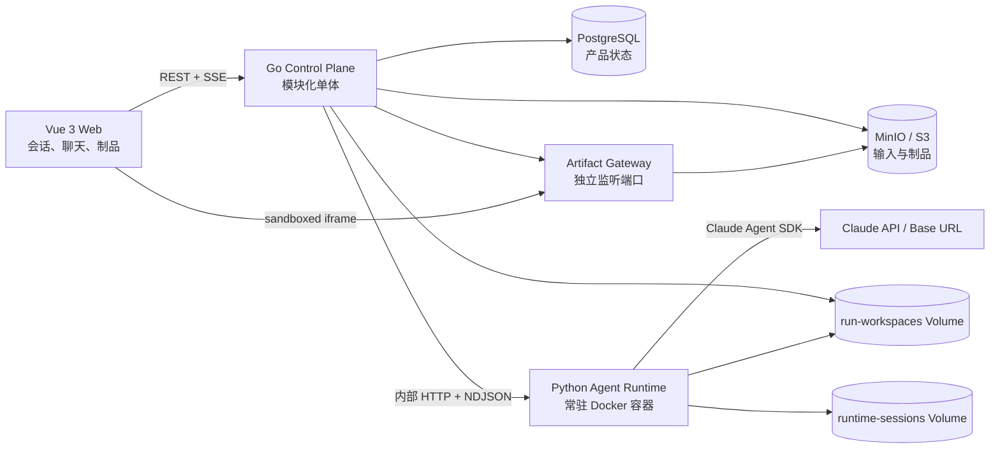

# Harness Forge V0 设计规格（中文版）

- **状态：** 已通过设计评审
- **日期：** 2026-07-19
- **目标周期：** 个人业余开发 2–4 周
- **英文原版：** `2026-07-19-harness-forge-design.md`

## 1. 概览

Harness Forge 是一个本地优先的 Agent Harness：用户提供对话和数据，控制平面调度沙箱中的 Agent，最终发布不可变、可查看的制品。

首个 Profile 是 **Geo Analyst**。用户上传带经纬度和数值字段的 CSV，通过自然语言提出分析要求，Claude 在 Python Runtime 中完成分析并生成包含文字结论、统计图和交互式地理可视化的 HTML 报告。

V0 只验证一条完整的垂直链路，不先建设通用插件平台。仓库名称为 **`harness-forge`**。

## 2. 产品目标与验收场景

V0 完成时，用户应当能够：

1. 根据 README，通过一个明确命令在本机启动全部模块。
2. 使用 `geo-analysis` Profile 创建 Project。
3. 上传包含经度、纬度和数值字段的 CSV。
4. 在 Project 中创建 Conversation，并提出地理分析要求。
5. 实时看到 Agent 回复、工具步骤和 Run 状态。
6. 在右侧查看包含文字、统计图和交互地图的 HTML 报告。
7. 在同一 Conversation 中继续追问，让 Claude 修改分析。
8. 将修改后的结果发布为新的不可变 Artifact，且旧版本仍可查看。
9. 在同一 Project 中创建第二个 Conversation：共享上传文件，但 Claude 上下文独立。
10. 浏览器刷新或 SSE 重连后，产品状态和事件历史不丢失。

## 3. V0 范围

### 3.1 包含的能力

- 本机、单用户运行。
- Vue 3 Web：Project、Conversation、上传、聊天、Run 进度和 Artifact 预览。
- Go 模块化单体控制平面。
- 使用 Claude Agent SDK 的常驻 Python Runtime 容器。
- 支持 Anthropic API Key 和可配置的 `ANTHROPIC_BASE_URL`。
- PostgreSQL 保存产品状态和持久 FIFO 队列。
- MinIO/S3 保存上传文件和不可变 Artifact。
- `runtime-sessions` Volume 保存 Claude SDK Session。
- `run-workspaces` Volume 在 Go 与 Python 之间交换输入和输出。
- 全局只允许一个 Agent Run 执行。
- Profile 配置机制，V0 只有 `geo-analysis`。
- 支持上传 CSV 和 GeoJSON；主验收场景使用 CSV。
- Claude 可自由编写和运行 Python。
- 固定、锁定版本的 Runtime 镜像，预装地理分析依赖。
- 支持 HTML、Markdown、图片和数据类 Artifact。
- 默认使用 Fake Runtime 的自动化测试，以及显式触发的真实 Claude 冒烟测试。

### 3.2 明确不做

- 用户认证、权限、多租户和公网托管。
- 多模型供应商抽象。
- WebSocket 和 Run 执行中的人工审批。
- 多任务并发。
- 独立 Go Worker、外部消息队列和分布式调度。
- 每个 Run 创建独立容器或 MicroVM。
- 强制网络隔离。V0 明确采用可信本地开发者模型，Runtime 可自由联网。
- 插件市场、插件安装生命周期和动态 Runtime 镜像矩阵。
- 自动重试。
- 后台保留策略、垃圾回收服务和完整监控栈。
- 代码编辑器、终端、文件树、地图编辑器和 Artifact 在线编辑。
- Generated Artifact 调用控制平面后端。

## 4. 统一领域术语

**Profile**：
一种 Harness 应用行为的版本化定义，包含提示词、工具策略和 Artifact 规则。V0 避免称为 Plugin。

**Project**：
一个长期存在的容器，拥有一个 Profile、一组 Input File 和多个 Conversation。Project 不是磁盘工作目录。

**Input File**：
用户上传并归属于 Project 的不可变对象。

**Conversation**：
Project 内一条产品对话，拥有有序 Message 和一个当前 SDK Session 指针。UI 中显示为“会话”，代码中不使用含糊的 `Session`。

**Message**：
Conversation 中用户或 Agent 可见的消息。

**Run**：
处理一条用户 Message 的一次执行尝试。同一 Message 手动重跑时可关联多个 Run。避免使用 Task 或 Job。

**SDK Session**：
Claude Agent SDK 内部的上下文记录，仅用于恢复 Agent 推理，不是产品聊天历史的数据源。

**Run Event**：
Run 执行期间追加产生的文字、工具、阶段和诊断事件。

**Artifact**：
成功 Run 发布的不可变、可独立查看的制品。一个 Run 可以发布多个 Artifact，最多一个为主制品。

**Workspace**：
只服务单个 Run 的临时文件系统目录，不称为 Project Workspace。

## 5. 总体架构



### 5.1 Vue Web

Web 只负责展示和浏览器交互：

- Project 与 Conversation 切换。
- Input File 上传。
- Message 提交。
- SSE 订阅、断线重连与事件补发。
- Run 进度和用户可理解的错误信息。
- Artifact 列表、历史版本和 iframe 预览。

Web 不接收、不解析 Claude Agent SDK 原始消息。

### 5.2 Go Control Plane

Go 是产品状态的唯一权威，负责：

- Project、Input File、Conversation、Message、Run、Run Event 和 Artifact 元数据。
- PostgreSQL 事务和 FIFO Run 领取。
- 全局并发度 1。
- 将 Profile 文件解析为不可变配置快照和 digest。
- 将 Input File 和 Profile Workspace 模板准备到 Run Workspace。
- 调用、取消和收尾 Agent Runtime execution。
- 将 Runtime Event 转换为持久 Run Event 和浏览器 SSE。
- 将已校验 Artifact 上传到 MinIO。
- 通过第二个 HTTP listener 提供 Artifact 内容。

Go 保持单进程模块化单体。内部 package 提供代码局部性，不代表独立部署服务。

### 5.3 Python Agent Runtime

Runtime 是 Claude Agent SDK 的防腐层，负责：

- SDK 配置与进程生命周期。
- SDK Session 创建、fork、resume、候选提交与删除。
- 应用 Go 传入的已解析 Profile 快照。
- 为每个 Run 启动一个 Python worker 子进程。
- 使用独立 Workspace 运行 Agent。
- 将 SDK 消息归一化为版本化 Runtime Event。
- 校验 `artifact-manifest.json` 和输出路径。
- 取消时终止 Agent worker 进程组。

Runtime 不连接 PostgreSQL 或 MinIO，也不是产品历史的数据源。

容器中有一个常驻 HTTP server。每个被接受的 Run 启动一个 Python worker；worker 内调用 Claude Agent SDK。Server 转发 worker 的 NDJSON 事件、管理进程组，并在 `runtime-sessions` 下原子记录 execution 状态。Runtime 在已有 active execution 时拒绝第二个 Run。

### 5.4 PostgreSQL

最小逻辑数据结构：

| 记录 | 关键字段 |
|---|---|
| `projects` | ID、名称、Profile ID/version、时间戳、`deleted_at` |
| `input_files` | Project ID、显示名、媒体类型、大小、digest、object key |
| `conversations` | Project ID、标题、active SDK Session ID、时间戳、`deleted_at` |
| `messages` | Conversation ID、role、content、时间戳 |
| `runs` | Conversation ID、触发 Message ID、status、phase、SDK Session IDs、error、`finalized_at`、时间戳 |
| `run_events` | Run ID、单调递增 sequence、type、payload、时间戳 |
| `artifacts` | Run ID、标题、type、entry path、object prefix、primary、manifest version |

产品历史永远不从 SDK transcript 重建。

### 5.5 MinIO/S3 与 Volume

对象键：

```text
projects/{project_id}/inputs/{input_file_id}/{filename}
projects/{project_id}/artifacts/{artifact_id}/{relative_path}
```

Go 在上传前分配 Artifact ID，并直接写入最终不可变前缀。MinIO 不公开访问；Artifact Gateway 只有在 PostgreSQL 存在已提交 Artifact 记录时才会返回对象。因此 DB 提交前的对象不可达，不需要 S3 rename/copy。若 DB 提交失败，会留下不可见孤儿前缀，由显式清理命令处理。

- `run-workspaces`：Go 与 Runtime 共享。Go 准备输入并发布输出，Runtime 在其中执行。
- `runtime-sessions`：仅 Runtime 挂载，保存 SDK transcript、execution record 和 tombstone。

只有 Go 持有 PostgreSQL 与 MinIO 凭证；Claude 凭证只注入 Runtime。

## 6. 仓库目录

```text
harness-forge/
├── apps/
│   └── web/
│       ├── src/
│       │   ├── app/
│       │   ├── features/
│       │   │   ├── projects/
│       │   │   ├── conversations/
│       │   │   ├── chat/
│       │   │   ├── runs/
│       │   │   └── artifacts/
│       │   ├── lib/
│       │   │   ├── api/
│       │   │   └── artifact-viewer/
│       │   └── main.ts
│       ├── tests/
│       ├── package.json
│       └── vite.config.ts
├── services/
│   ├── control-plane/
│   │   ├── cmd/harness-forge/main.go
│   │   ├── internal/
│   │   │   ├── projects/
│   │   │   ├── conversations/
│   │   │   ├── runs/
│   │   │   ├── artifacts/
│   │   │   ├── profiles/
│   │   │   ├── agentexec/
│   │   │   ├── httpapi/
│   │   │   ├── artifacthttp/
│   │   │   ├── postgres/
│   │   │   └── objectstore/
│   │   ├── migrations/
│   │   ├── tests/
│   │   └── go.mod
│   └── agent-runtime/
│       ├── src/harness_forge_runtime/
│       │   ├── api.py
│       │   ├── runner.py
│       │   ├── claude.py
│       │   ├── sessions.py
│       │   ├── workspaces.py
│       │   ├── artifacts.py
│       │   ├── permissions.py
│       │   └── events.py
│       ├── tests/
│       ├── Dockerfile
│       ├── pyproject.toml
│       └── lockfile
├── profiles/geo-analysis/
│   ├── profile.yaml
│   ├── system-prompt.md
│   └── workspace-template/assets/echarts.min.js
├── contracts/
│   ├── control-plane.openapi.yaml
│   ├── runtime/v1/
│   │   ├── run-request.schema.json
│   │   └── runtime-event.schema.json
│   └── artifacts/v1/artifact-manifest.schema.json
├── tests/e2e/
│   ├── scenarios/geo-csv-report/
│   └── fixtures/
├── infra/
│   ├── minio/
│   └── postgres/
├── docs/
├── docker-compose.yaml
├── Makefile
├── .env.example
├── .gitignore
└── README.md
```

V0 不创建 `plugins/`、跨语言 `shared/`、通用 Go `pkg/`、多个 Go 进程或为每张表建立 Repository interface。`agentexec` 是必要 seam，因为 V0 同时存在 HTTP Runtime 和 Fake Runtime adapter。

## 7. 跨进程接口

### 7.1 浏览器侧能力

`control-plane.openapi.yaml` 至少覆盖：

- Project 的列表、创建、读取、重命名和逻辑删除。
- Project Input File 的上传与列表。
- Conversation 的列表、创建、重命名和逻辑删除。
- Conversation Message 列表。
- 原子提交用户 Message 并创建 queued Run。
- Run 状态和 Run Event 查询。
- 使用 SSE 和最后 sequence 恢复 Run Event。
- 取消 queued 或 active Run。
- Artifact 列表和主制品标识。

Project 和 Conversation 删除都是逻辑删除。若目标下存在 `queued`、`running` 或尚未 finalized 的 Run，删除返回 `409 Conflict`。逻辑删除后不再接受 Message、Run 或迟到的 Session promotion。

删除请求不直接清理外部资源。幂等命令 `make purge-deleted` 按以下顺序清理：

1. 删除归属的 MinIO 前缀。
2. 请求 Runtime 删除归属 SDK Session。
3. 删除保留的 Run Workspace。
4. 删除终态 Runtime execution tombstone。
5. 最后硬删除 PostgreSQL 记录。

外部对象已经不存在视为成功，因此命令崩溃后可重跑。清理 Conversation 不删除 Project 共享 Input File；清理 Project 拥有所有子记录。

### 7.2 Runtime HTTP 接口

```text
GET    /health
GET    /v1/executions
HEAD   /v1/sessions/{session_id}
POST   /v1/runs/{run_id}/execute   -> application/x-ndjson
POST   /v1/runs/{run_id}/cancel
POST   /v1/runs/{run_id}/finalize  -> {"decision":"commit"|"abort"}
DELETE /v1/executions/{run_id}
DELETE /v1/sessions/{session_id}
```

执行请求包含：

- Run、Project、Conversation ID。
- 新用户 prompt。
- 可选 source SDK Session ID。
- 已解析 Profile 快照和 digest。
- 容器内 input/workspace/output 绝对路径。
- 最大轮数和可选预算。

请求不包含数据库、对象存储或浏览器认证信息。

`run_id` 是 Runtime execution 幂等键。重复 execute 不会启动第二个 worker：active duplicate 返回 `409 already_running`；已 finalized 的 Run 返回已记录 disposition。Runtime 同一时刻只接受一个 active Run。

Runtime 在发出 `agent.completed` 之前，必须把候选 SDK Session 和 execution record 持久化。`agent.completed` 携带 `candidate_sdk_session_id` 与已经校验的 Artifact candidate 摘要。

Go 完成产品事务后调用 `finalize(commit)`：Runtime 保留候选 Session，并将 execution record 原子替换成 committed tombstone。失败、取消或发布拒绝时调用 `finalize(abort)`：Runtime 删除候选 Session，并写 aborted tombstone。相同 decision 可重复，冲突 decision 被拒绝。

`DELETE /v1/executions/{run_id}` 只删除终态 tombstone；不存在时也成功，active 或 unfinalized execution 则拒绝。

### 7.3 Runtime Event

每个 NDJSON event 包含版本、Run ID、Runtime 本地 sequence、type、timestamp 和类型化 payload。Go 在持久化时分配产品 Run Event sequence。

V0 Runtime event：

```text
phase.changed
assistant.delta
assistant.message
tool.started
tool.completed
artifact.candidate
agent.completed
agent.failed
```

`agent.*` 只描述 Claude execution。只有 Go 能在产品状态提交后发出：

```text
run.succeeded
run.failed
run.cancelled
artifact.published
```

同一兼容版本中，消费者必须忽略未知的非终态 event。

### 7.4 Artifact Manifest

有可发布输出时，`outputs/artifact-manifest.json` 必须存在。

```json
{
  "schema_version": 1,
  "artifacts": [
    {
      "name": "main-report",
      "title": "Point Distribution Analysis",
      "type": "html",
      "entry": "report/index.html",
      "primary": true
    }
  ]
}
```

规则：

- `schema_version` 必填。
- 同一 Run 内 Artifact name 唯一。
- 最多一个 primary。
- entry 必须存在于 output root 下。
- 拒绝绝对路径、`..` 路径穿越和逃逸符号链接。
- 上传前执行大小限制。
- 成功的纯对话 Run 可以不发布 Artifact；一旦声明 Artifact，必须完整通过校验。

## 8. Run、Session 与崩溃恢复

### 8.1 状态

```text
queued -> running -> succeeded
                 -> failed
                 -> cancelled
                 -> interrupted
queued          -> cancelled
```

`running` 下通过 phase 表示 `preparing`、`agent` 或 `publishing`。

### 8.2 队列与启动协调

- PostgreSQL 保存 FIFO 队列。
- Go 同时只领取一个 queued Run。
- Runtime 也独立拒绝第二个 active execution。
- Go 不会在当前 Run 写入 `finalized_at` 前领取下一项。
- Go 启动时必须先调用 `GET /v1/executions`，完成协调后才启动 scheduler。
- PostgreSQL `running` 且 Runtime 有 active execution：先取消并确认停止，再标记 `interrupted`。
- Runtime 有 execution 但 PostgreSQL 没有对应 running Run：视为孤儿，取消并 `finalize(abort)`。
- PostgreSQL `running` 但 Runtime 没有 execution：立即标记 `interrupted` 并 finalized。
- Runtime HTTP server 重启时，先终止本地 execution record 对应的 worker 进程组，再报告 healthy。
- 不自动重试。

### 8.3 SDK Session fork 与提交

1. Go 将 Conversation 当前 active SDK Session ID 传给 Runtime。
2. Runtime 原子记录 Run、source Session、worker 和 execution 状态。
3. 有 source Session 时 fork；首轮则创建新候选 Session。
4. Run 只在候选 Session 上执行。
5. 候选 transcript durable 后才能发出 `agent.completed`。
6. Go 在一个 PostgreSQL 事务中提交 Artifact 元数据、Conversation 新 active Session 指针和 Run `succeeded`。
7. Go 调用 `finalize(commit)`；确认后写入 `finalized_at`。
8. 失败或取消时调用 `finalize(abort)`，旧 active Session 不变。

若 Go 在数据库提交后、`finalize(commit)` 前崩溃，启动协调看到候选 ID 已成为 Conversation active 指针后重复 commit。若 commit 已完成但 `finalized_at` 未写入，Go 用 `HEAD /v1/sessions/{id}` 确认 Session 存在，再补写 `finalized_at`。Runtime 状态不能单独推进 Conversation。

### 8.4 取消

- 取消 queued Run 只更新 PostgreSQL，不调用 Runtime。
- 在 agent phase 取消时，Go 要求 Runtime 终止 Agent 进程；超时后升级为强制停止。
- Run 一旦进入 publishing phase 就拒绝取消，让原子发布流程完成。
- cancelled 和 failed Run 都不得提升候选 SDK Session，也不得发布可见 Artifact。

### 8.5 终态收尾矩阵

`finalized_at` 表示 Runtime disposition 已完成，或该 Run 从未创建 Runtime 状态。只有设置后才发产品终态 event。

| 路径 | Run status | Runtime disposition | `finalized_at` |
|---|---|---|---|
| queued 时取消 | `cancelled` | 无 | 与取消同一事务写入 |
| execute 前准备失败 | `failed` | 无 | 与失败同一事务写入 |
| 已创建 execution 后 Agent/Runtime 失败 | `failed` | `finalize(abort)` | abort 确认后 |
| Artifact 校验或发布失败 | `failed` | `finalize(abort)` | abort 确认后 |
| Agent 阶段取消 | `cancelled` | cancel 后 `finalize(abort)` | abort 确认后 |
| Control Plane 重启协调 | `interrupted` | 有 Runtime 状态则 abort；没有则无 | abort 确认后，或立即 |
| 成功执行与发布 | `succeeded` | `finalize(commit)` | commit 确认后 |

若 Runtime 暂时不可用，Run 可以已有终态 status 但尚未 finalized。此时 scheduler 和删除操作暂停，直到协调流程完成幂等 disposition。

## 9. 核心数据流

1. 浏览器将 Input File 上传到 Go。
2. Go 写入 MinIO 并在 PostgreSQL 保存元数据。
3. 浏览器提交 Message。
4. Go 在一个事务中写 Message 和 queued Run。
5. 浏览器订阅 Run SSE。
6. Scheduler 领取最早 queued Run。
7. Go 创建 Workspace，复制 Profile Workspace 模板，并准备全部未删除 Project Input File。
8. Go 调用 Runtime execute。
9. Runtime 持久化 execution、fork/创建候选 SDK Session、启动 worker 并流式返回 normalized event。
10. Go 以单调 sequence 持久化关键事件并转发 SSE。
11. Claude 在 output 目录写入文件和 Manifest。
12. Runtime 校验并发出 `agent.completed`。
13. Go 分配 Artifact ID，将文件上传到最终不可变前缀；此时因无 DB 元数据仍不可见。
14. Go 在一个事务中提交 Artifact、active SDK Session pointer 和 Run succeeded。
15. Go 调用 `finalize(commit)` 并写 `finalized_at`。
16. Go 发出 `artifact.published` 和 `run.succeeded`，浏览器通过 Artifact Gateway 打开主制品。

浏览器 SSE 断开不会取消 Run。重连使用最后收到的 durable sequence 补发。

## 10. 错误与清理

产品错误码：

```text
invalid_input
runtime_unavailable
agent_failed
agent_timeout
manifest_invalid
artifact_publish_failed
interrupted
```

每个错误包含安全的用户 message 和独立的结构化诊断 detail、correlation ID。

- 不自动重试。
- Manifest 无效时 Run 失败，不发布 Artifact。
- 对象上传失败留下不可达的部分前缀并尽力清理。
- DB 提交失败留下不可达孤儿前缀，交给幂等清理命令。
- 候选 SDK Session 只有成功事务提交后才能成为 active。
- 启动协调必须解决所有 unfinalized execution，之后才能开始下一 Run。
- 失败 Workspace 暂时保留，显式清理。
- 当前 Run 失败时，UI 继续展示最近一次成功 Artifact。

## 11. Artifact 渲染隔离

- Go 使用第二个 listener/origin 提供 Artifact。
- iframe 使用 `sandbox="allow-scripts"`，不包含 `allow-same-origin`。
- Artifact response 不携带控制平面 cookie 或凭证。
- CSP 禁止网络连接，并限制允许嵌入的 Web origin。
- Generated Artifact 不能调用控制平面。
- ECharts 由 Profile 提供本地资源，查看时不依赖 CDN。
- Artifact Gateway 通过已存元数据解析对象键，不直接信任 URL 路径。

Runtime 本身在 V0 中允许自由联网，这是已接受的可信本地威胁模型，不是安全能力声明。

## 12. 界面设计

```text
┌──────────────────┬──────────────────────────┬─────────────────────────────┐
│ 会话管理         │ 对话                     │ 制品                        │
│ Project 切换     │ Project 输入摘要         │ 主制品 / 其他 / 历史         │
│ 新建会话         │ Message                  │ sandboxed iframe            │
│ 过滤、重命名     │ Run 步骤和错误           │                             │
│ 逻辑删除         │ 输入框                   │                             │
└──────────────────┴──────────────────────────┴─────────────────────────────┘
```

- 会话栏约 240px，可折叠，按最近活动排序并支持本地关键词过滤。
- 对话栏约 380–480px，可拖动调整。
- 制品栏占剩余宽度。
- Project Input File 在 Conversation 间共享。
- 新 Conversation 创建独立 SDK 上下文。
- 工具活动以产品化步骤显示，不展示原始 SDK JSON。
- 默认打开最新 Run 的主 Artifact，可切换其他制品和旧 Run。
- 窄屏退化成会话/对话/制品标签；移动端打磨不属于 V0。

## 13. Geo Analysis Profile

`profiles/geo-analysis/profile.yaml` 至少包含：

- Profile ID、version、display name。
- System prompt 路径。
- Built-in tool 和 permission policy。
- 最大 Agent 轮数和可选预算。
- 接受的 input media type。
- Artifact Manifest schema version 和允许类型。
- Workspace template 路径。

固定 Runtime 镜像预装并锁定 pandas、GeoPandas、Shapely、PyProj、DuckDB 等依赖。只有真实出现第二个依赖冲突 Profile 时才支持 Profile 选择不同 Runtime 镜像。

## 14. 测试策略

### 14.1 模块测试

- Go：Run 状态转换、FIFO claim、SSE 补发、Artifact 发布规则。
- Python：SDK event 转换、Session fork/resume 参数、Workspace 路径和 Manifest 校验。
- Vue：Conversation 状态、SSE 重连、Artifact 版本和错误展示。

### 14.2 集成测试

- 使用真实 PostgreSQL 和 MinIO。
- 验证 Message/Run 事务。
- 验证队列、重启协调和全局并发。
- 验证元数据控制 Artifact 可见性、孤儿清理和发布失败。
- 验证 Go 与 Fake Runtime 的 NDJSON 流。
- 表驱动覆盖终态 finalization 矩阵。
- 覆盖 finalize acknowledgement 前后崩溃恢复和 tombstone 幂等删除。

### 14.3 浏览器 E2E

Playwright 使用 Fake Runtime 完成：

```text
创建 Project
→ 上传固定 CSV
→ 创建 Conversation
→ 发送分析请求
→ 接收 scripted events
→ 发布固定 HTML Artifact
→ iframe 展示
→ 刷新后验证持久状态
```

### 14.4 真实 Claude 冒烟

`make smoke-claude` 显式触发，要求 Claude 凭证。使用小型固定 CSV、有限轮数和预算，只验证 SDK 连通、Python 执行、Manifest 合法和主 Artifact 可打开，不断言 Claude 的具体措辞或图表内容。

## 15. 交付阶段

### 阶段 1：Walking Skeleton

- 仓库骨架和 `docker-compose.yaml`。
- PostgreSQL、MinIO、Go、Vue 和 Fake Runtime。
- 版本化 contracts。
- 最小 Project、Conversation、Message、Run 模型。
- 固定 HTML Artifact 与 iframe。

### 阶段 2：真实 Agent 闭环

- 地理 Runtime 镜像。
- Claude Agent SDK、凭证和 Base URL。
- Session 创建、fork、resume、finalize。
- CSV Workspace 与 Python 分析。
- Manifest 与 Artifact 发布。

### 阶段 3：产品体验

- 三栏 UI 和 Conversation 管理。
- 流式消息、工具步骤和 Run 时间线。
- 多 Artifact、主制品和历史。
- 重连、取消和错误处理。

### 阶段 4：可重复交付

- 模块、集成和浏览器测试。
- opt-in 真实 Claude smoke。
- README、开发和排障文档。
- 在另一台 Docker 环境验证启动。

## 16. 演进触发条件

| 真实信号 | 再引入的能力 |
|---|---|
| 第二个 Profile 依赖冲突 | Profile 选择 Runtime 镜像 |
| 不可信输入或多用户 | 每 Run 容器、egress policy、认证与租户隔离 |
| 确实需要并发 | Worker、lease、并发度和配额 |
| Agent 需要中途询问 | WebSocket 和 HITL 状态 |
| Runtime 移到远程主机 | Workspace transfer protocol 与 remote Executor |
| Artifact 需要修改产品状态 | 带 scope capability token 的受限 Artifact interface |
| 日志不足以排障 | OpenTelemetry 和 metrics stack |

## 17. 主要风险

| 风险 | V0 缓解方式 |
|---|---|
| Claude SDK wire format 变化 | Python adapter + 版本化 Harness event |
| 测试不稳定或成本高 | 默认 Fake Runtime，真实 smoke 限轮数和预算 |
| 失败 Run 污染上下文 | Session fork + 成功后提交 |
| Generated HTML 攻击主 UI | 独立 listener、sandboxed iframe、CSP、无产品凭证 |
| 共享 Runtime 跨 Run 泄漏 | 可信本地模型、单并发、独立 Workspace |
| Runtime 自由联网导致数据外传 | 明确排除在 V0 安全范围外，多用户前必须重做 |
| PostgreSQL 与 MinIO 对个人项目偏重 | 基础设施实践本身是已确认的项目目标 |
| Session、Workspace 和 tombstone 增长 | 显式幂等清理命令，不提前建设后台服务 |

## 18. 官方参考

- [Claude Agent SDK for Python](https://github.com/anthropics/claude-agent-sdk-python)
- [Anthropic：Hosting your agent](https://platform.claude.com/cookbook/claude-agent-sdk-07-hosting-the-agent)
- [Anthropic：Building a session browser](https://platform.claude.com/cookbook/claude-agent-sdk-05-building-a-session-browser)
- [Anthropic：Authentication](https://platform.claude.com/docs/en/manage-claude/authentication)
